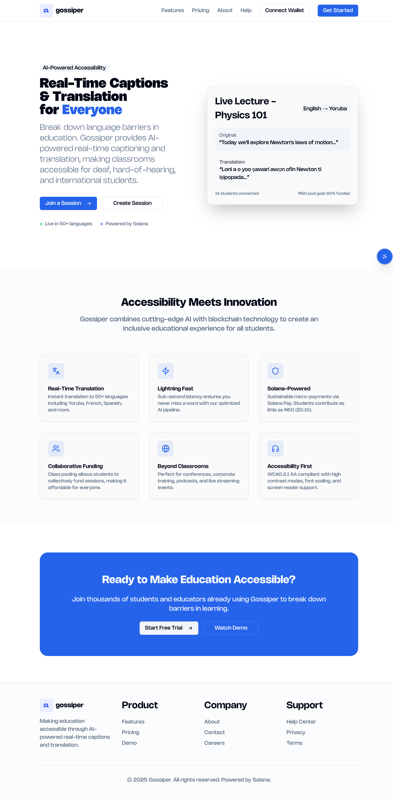
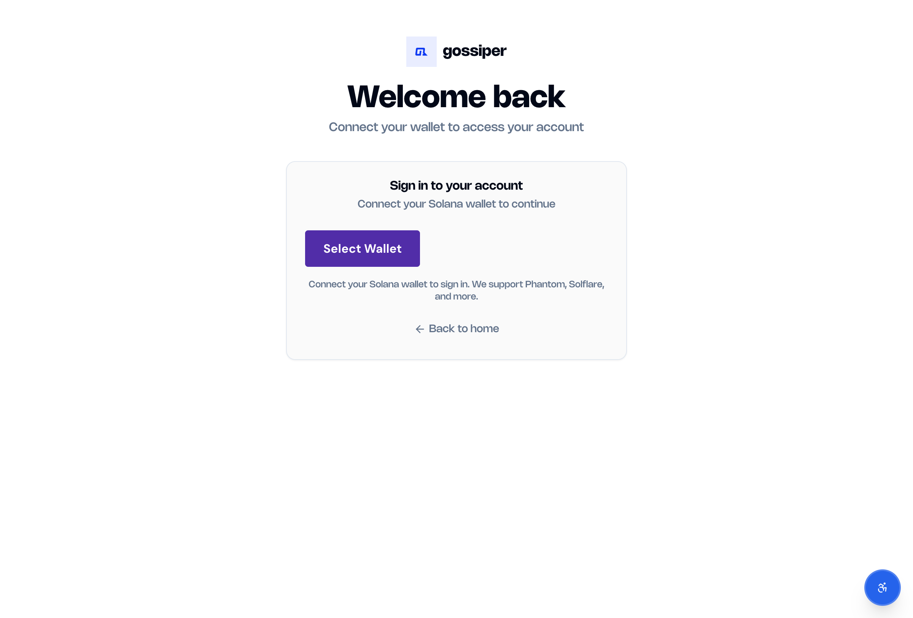
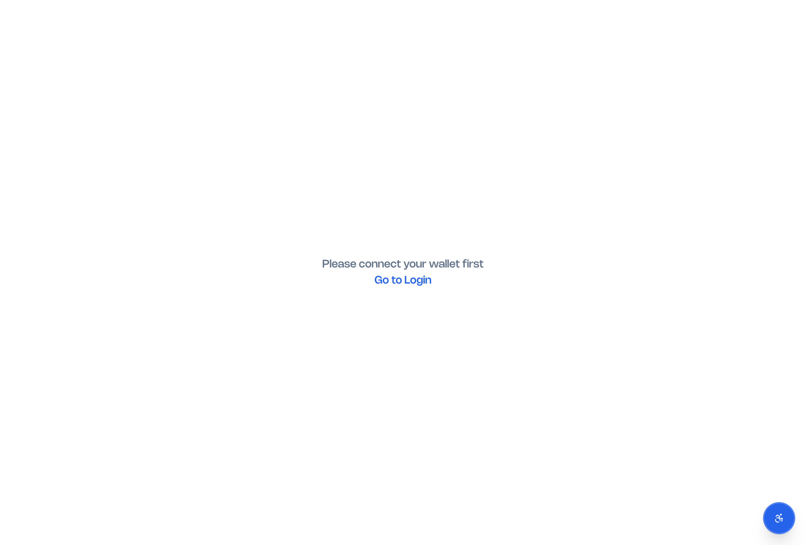
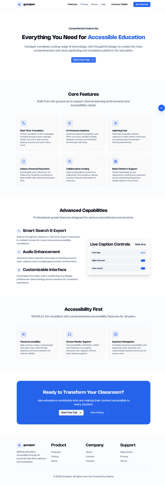

# Gossiper: Real-Time Captions + Solana Payments

**Live captions for education, funded by ₦50 payments**

---

## 🎯 Elevator Pitch

Current captioning tools cost $100s per session and rarely support African languages. With Gossiper, a group of students can pool ₦50 each to unlock live captions for everyone - accessible, affordable, and inclusive.


---

## 💡 Value Proposition

### Problems We Solve

- International students can't understand lectures in foreign languages
- Deaf students need real-time captions but can't afford expensive tools

### What We Built

Students join lecture sessions and get live captions in their language.

**Key features:**
- Live transcription with AssemblyAI supporting 50+ languages including Yoruba, Swahili, Hausa
- Solana Pay integration for ₦50 ($0.10) micro-payments
- Wallet-only authentication - no passwords needed
- Pooled funding model - students contribute collectively
- WCAG 2.1 AA accessibility compliance

### Impact

- **Students**: Real-time captions in native language at 99% lower cost than traditional tools
- **Lecturers**: Inclusive education without expensive licensing
- **Institutions**: Accessibility without infrastructure overhead
- **African languages**: First-class support for underserved languages

---

## 🎬 Demo Flow

### 📸 App Screenshots

**Homepage - AI-Powered Real-Time Captions & Translation**

*Modern, accessible homepage showcasing real-time translation capabilities with live demo showing English → Yoruba translation and collaborative funding.*

**Wallet Authentication - Solana Integration**

*Secure wallet-only authentication using Phantom, Solflare, and other Solana wallets. No passwords required - just connect your wallet to access the platform.*

**Session Access - Wallet Required**

*Students must connect their wallet before joining sessions, ensuring secure access and enabling Solana Pay micro-transactions.*

**Comprehensive Features**

*Complete feature overview including real-time translation, AI-powered captions, Solana payments, collaborative funding, and WCAG 2.1 AA accessibility compliance.*

### User Journey

1. **Connect Wallet** → Phantom/Solflare - no signup needed
2. **Join Session** → Enter session code from lecturer
3. **Select Language** → Choose from 50+ languages (Yoruba, French, Spanish, etc.)
4. **Live Captions** → Real-time transcription appears instantly
5. **Contribute** → Send ₦50 via Solana Pay to fund the session

### Example Scenario

A student joins a lecture given in English. They select "Yoruba" as their preferred language. Captions appear in real-time, translated to Yoruba. The student clicks "Contribute ₦50" and sends SOL via their wallet. Session funding progress updates live for all participants.

---

## 🏗️ Technical Stack

### Frontend
- Next.js 14 (App Router) + TypeScript 5.0
- Tailwind CSS + Radix UI for accessible components
- Solana Wallet Adapter (Phantom/Solflare support)

### Backend
- AssemblyAI API for real-time speech-to-text
- WebSocket connections for live updates
- Vercel serverless functions
- PostgreSQL for session management

### Blockchain
- Solana Pay for micro-payment processing
- Wallet-based authentication (no passwords)
- Real-time transaction tracking

### Data Flow
```
Audio Input → AssemblyAI → Webhook → Live Captions → Translation → User Interface
Student Wallet → Solana Pay → Session Pool → Lecturer Wallet
```

### Key Technical Features
- Sub-second transcription latency
- 50+ languages with real-time translation
- WCAG 2.1 AA accessibility compliance (screen readers, keyboard navigation, high contrast)
- Serverless architecture with automatic scaling
- Multiple audio format support (WebM, MP3, WAV)

---

## 🎯 Hackathon Achievement

### What We Built
- Complete full-stack application with Next.js 14 and TypeScript
- Real-time AI transcription with AssemblyAI
- Solana blockchain integration with wallet authentication and Solana Pay
- 50+ language support including African languages (Yoruba, Swahili, Hausa)
- Production-ready deployment on Vercel

### Technical Challenges
- Real-time WebSocket connections for live transcription
- Blockchain payment processing with micro-transactions
- Multi-language AI translation pipeline
- WCAG 2.1 AA accessibility compliance
- Serverless architecture with proper state management

### Innovation
First integration of real-time AI transcription with blockchain payments for educational accessibility. Combines collaborative micro-funding (₦50 payments) with wallet-only authentication and native support for underserved African languages.

---

**Gossiper: Making every voice heard, in every language, for every student.**
